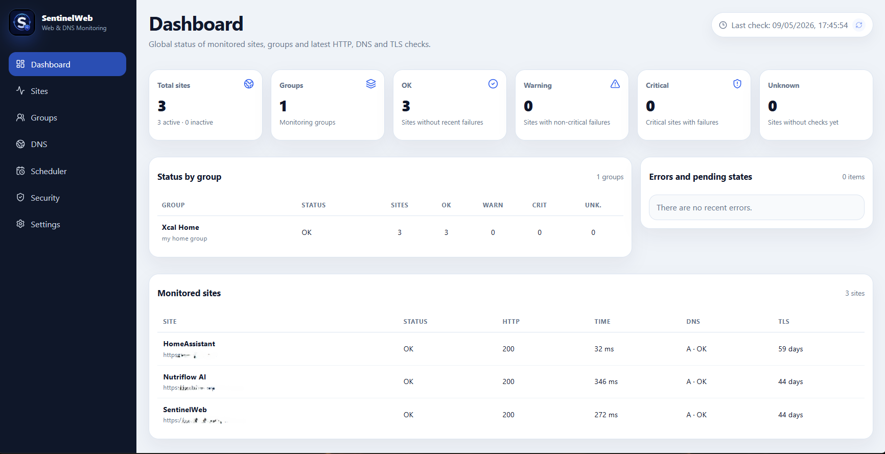
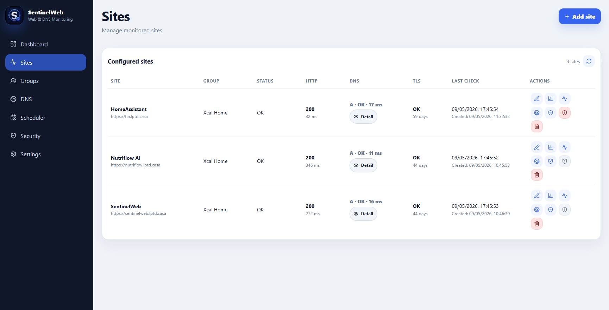
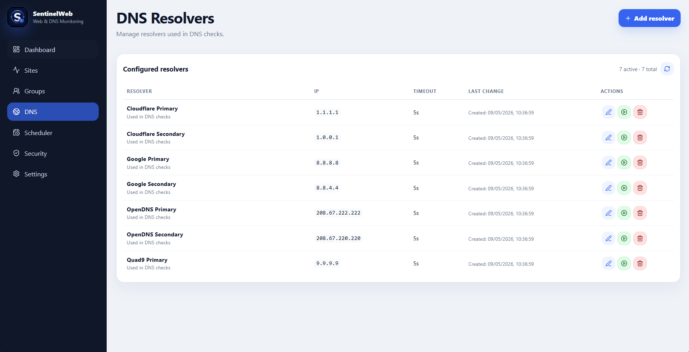
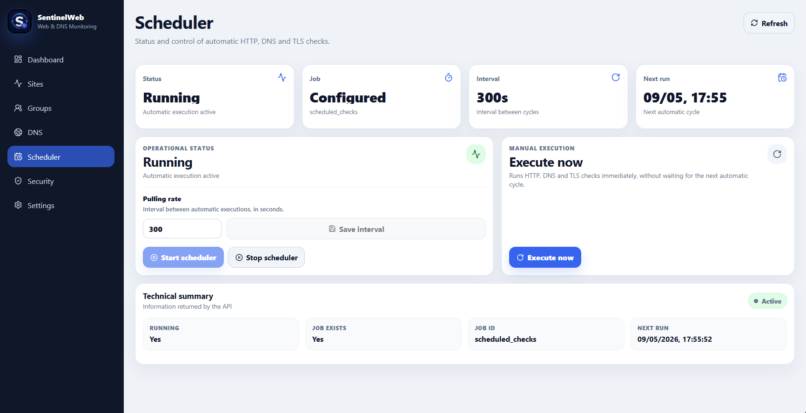
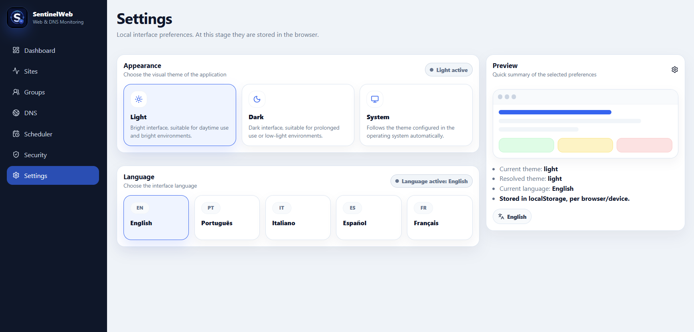
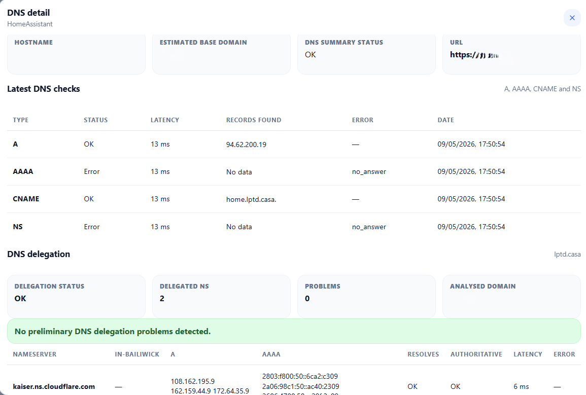
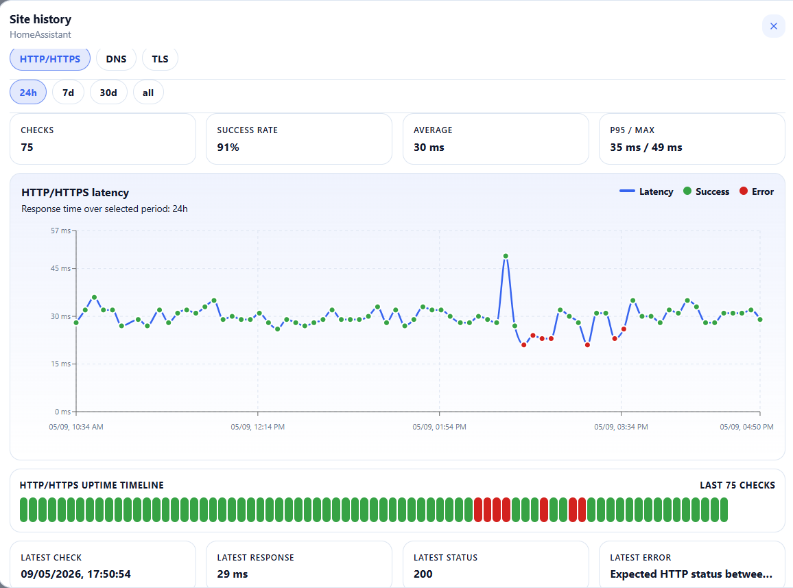
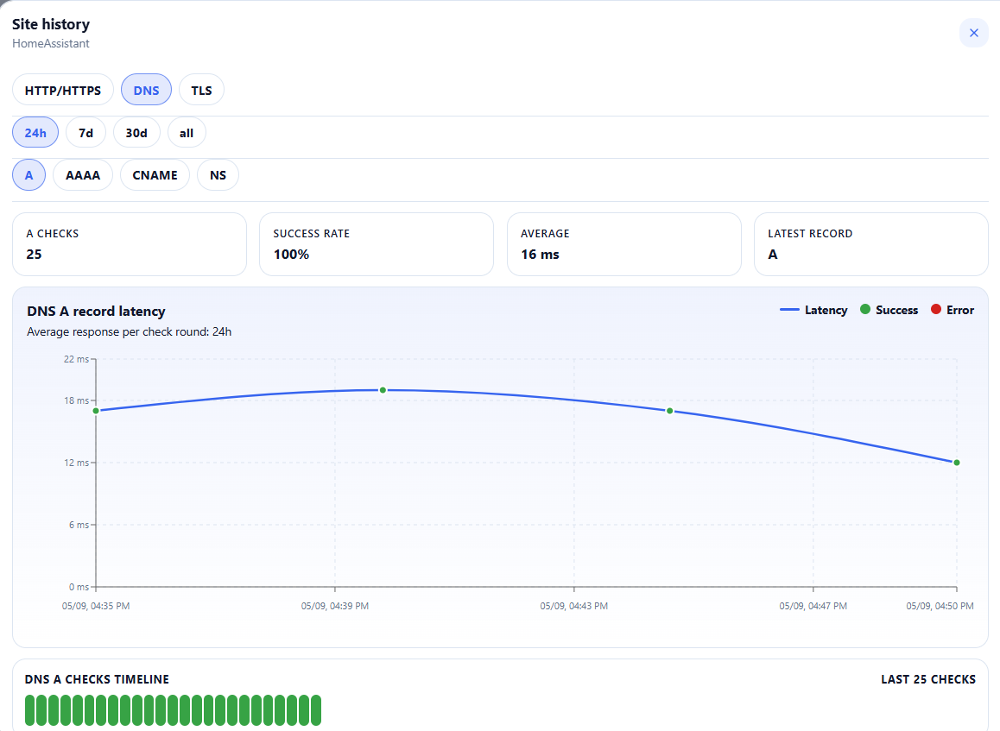
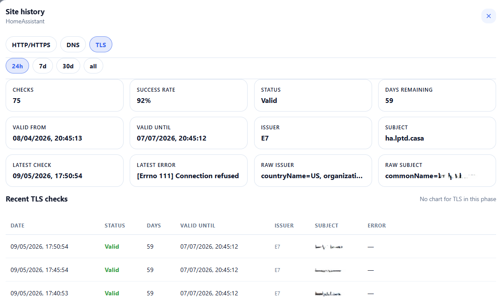

# SentinelWeb

**SentinelWeb** is a professional web monitoring and security posture dashboard designed for HTTP/HTTPS availability monitoring, DNS health checks, TLS visibility, and security header assessment.

The project is currently developed as a private codebase. This public repository acts as a project showcase, roadmap, and collaboration entry point.

## What SentinelWeb does

SentinelWeb helps monitor and assess web-facing services by combining availability checks with security-oriented visibility.

It is designed for teams that want to know not only whether a service is online, but also whether it is exposed safely, whether DNS is behaving correctly, whether TLS is valid, and whether important security headers are missing or weak.

Current and planned capabilities include:

- HTTP/HTTPS availability monitoring
- DNS health checks
- TLS certificate monitoring
- Security header scoring
- Black-box public scans
- Gray-box authenticated scans
- Cloudflare Access-aware detection
- Encrypted credentials vault for protected checks
- Security posture dashboard
- Incident history and reporting
- Future white-box/origin scan support

## Why it exists

Many internal and public-facing services are monitored only for uptime.

That is not enough.

A service can be online but still have weak TLS, missing security headers, poor DNS visibility, exposed technologies, or confusing behaviour behind Cloudflare, Akamai, Imperva, NGINX or another edge layer.

SentinelWeb aims to combine operational monitoring with blue-team visibility.

The goal is to help answer questions such as:

- Is the service online?
- Is DNS resolving correctly?
- Is the TLS certificate valid?
- Are important security headers present?
- Is the public edge hiding the real origin?
- Is the scan seeing the real application or only an access gateway?
- What changed after applying a security remediation?

## Current status

The project is under active development.

Implemented so far:

- FastAPI backend
- React + TypeScript frontend
- SQLite-backed persistence
- Site and group management
- HTTP checks
- DNS checks
- TLS checks
- Security header checks
- Cloudflare Access detection
- Gray-box checks using service-token authentication
- Encrypted local vault for protected scan credentials
- NGINX deployment support
- systemd deployment support
- Cloudflare-aware publication model
- Scheduler for recurring checks
- Per-site HTTP, DNS and TLS history views
- UI preferences for appearance and language

## Product story

SentinelWeb starts with a simple operational view: a dashboard showing which services are healthy, which groups they belong to, and whether recent checks are succeeding.

From there, it adds deeper visibility:

1. **Inventory** — all monitored services in one place.
2. **Availability** — HTTP status, response time and uptime patterns.
3. **DNS** — A, AAAA, CNAME, NS and delegation checks.
4. **TLS** — certificate validity, issuer, subject and remaining days.
5. **Security posture** — missing headers, weak CSP values and exposed technology headers.
6. **Access-layer awareness** — distinction between what the public Internet sees and what the protected application actually exposes.
7. **Credential vault** — encrypted storage for authorised gray-box scans.

This makes SentinelWeb useful both as a monitoring dashboard and as a lightweight security posture tool.

## Scan modes

SentinelWeb distinguishes between different levels of visibility.

### Black-box scan

Tests what an anonymous public user sees from the Internet.

Useful for:

- public exposure checks
- Cloudflare/Akamai/Imperva detection
- unauthenticated surface assessment
- edge-layer behaviour
- redirects and public headers

A black-box scan is intentionally limited. If a site is protected by an access gateway, the scan may only see the gateway response.

### Gray-box scan

Tests a protected application using authorised credentials, such as Cloudflare Access service tokens.

Useful for:

- validating the real application behind an access gateway
- avoiding false positives from login/interstitial pages
- checking headers and posture after authentication
- comparing edge behaviour with authenticated application behaviour

SentinelWeb supports gray-box scanning through an encrypted local vault that stores per-site credentials.

### White-box scan

Planned mode for testing internal/origin services directly from trusted networks.

Useful for:

- checking reverse proxy/origin configuration
- comparing edge vs origin posture
- validating internal-only services
- detecting services that are safe at the edge but weak at the origin

## Technology stack

| Layer | Technology |
|---|---|
| Backend | FastAPI |
| Data model | SQLModel |
| Database | SQLite, future PostgreSQL support |
| Frontend | React |
| Language | TypeScript |
| Build tool | Vite |
| Deployment | NGINX + systemd |
| Security checks | HTTPX-based scanner |
| Credential storage | Encrypted local vault |

## Screenshots

The following screenshots use anonymised data and example domains.

### Dashboard overview

The main dashboard provides a global view of monitored services, groups, latest HTTP/DNS/TLS checks and pending errors.

### Sites inventory

The Sites page centralises monitored endpoints and provides quick actions for HTTP, DNS, TLS, history and security checks.

### DNS resolvers

SentinelWeb supports configurable DNS resolvers, allowing checks to be run through different public or internal resolvers.

### Scheduler

The scheduler controls recurring HTTP, DNS and TLS checks. It also allows manual execution when immediate validation is needed.

### Security posture overview

The Security page summarises security header posture across monitored services, highlighting missing headers, weak values and exposed technology headers.

### Security detail

The security detail view shows the reasoning behind a score, remediation guidance and per-header analysis.

### Settings

The Settings page manages local interface preferences such as appearance and language.

### DNS detail

The DNS detail view inspects A, AAAA, CNAME and NS checks, including latency, status, records found and delegation information.

### HTTP/HTTPS history

The HTTP history view shows latency trends, success/error markers, uptime timeline and recent response details.

### DNS history

The DNS history view tracks DNS response latency and success rate over time for specific record types.

### TLS history

The TLS history view tracks certificate status, issuer, subject, validity dates and days remaining.

## Security posture philosophy

SentinelWeb is not designed to replace a full vulnerability scanner.

Instead, it focuses on practical visibility:

- Is the service reachable?
- Is it healthy?
- Is DNS correct?
- Is TLS valid?
- Are security headers present?
- Is the score measuring the real origin, or only the public edge?
- Are Cloudflare/NGINX/access-layer responses being interpreted correctly?

This makes SentinelWeb useful as a lightweight blue-team dashboard for small teams, labs, home infrastructure and internal tooling.

## Repository access

The source code is currently private.

If you are interested in reviewing, testing, contributing, or discussing the project, please contact the maintainer.

Possible access modes:

- read-only review
- testing
- contribution
- private deployment discussion

## Contact

Open an issue in this showcase repository or contact the maintainer directly through GitHub.

## License

The public showcase content is provided for informational purposes.

The application source code is not publicly licensed at this stage.