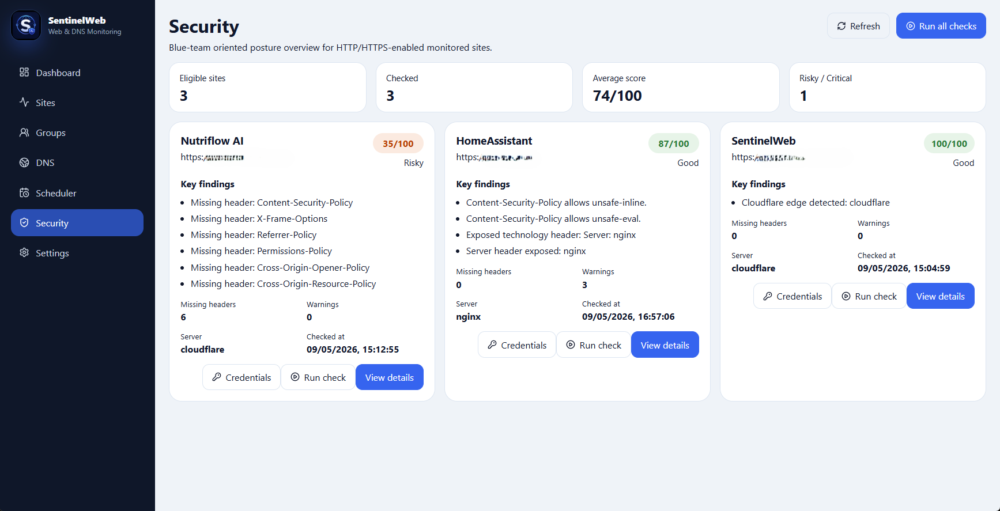
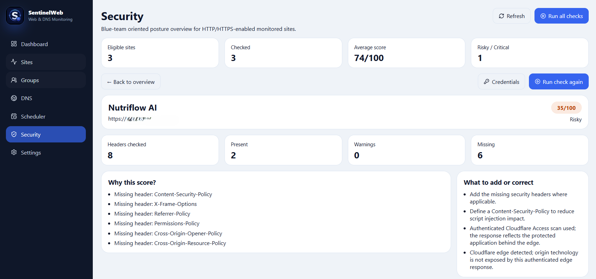

# Architecture

SentinelWeb is split into a FastAPI backend and a React frontend.

## High-level architecture

```text
Browser
  ↓
NGINX
  ↓
React frontend
  ↓ /api
FastAPI backend
  ↓
SQLite / future PostgreSQL
```

This is the current production-oriented deployment model: NGINX serves the frontend as static files and proxies API requests to the FastAPI backend.

## Backend

The backend is responsible for:

- managing monitored sites;
- managing groups;
- running HTTP checks;
- running DNS checks;
- running TLS checks;
- running security header checks;
- storing check results;
- exposing API endpoints for the frontend.

## Frontend

The frontend provides:

- dashboard overview;
- site management;
- group management;
- scheduler controls;
- security posture dashboard;
- security check detail views;
- credential vault UI.

## Security scan model

SentinelWeb separates scan visibility into three concepts:

```text
Black-box scan
  → public unauthenticated view

Gray-box scan
  → authenticated view through an access layer

White-box scan
  → internal/origin view
```

This distinction is important because modern services are often protected by Cloudflare, Akamai, Imperva, F5, NGINX, or similar edge and access-layer components.

A public scanner may only see the access gateway, not the real origin application.

## Black-box scan

A black-box scan tests what an anonymous external user can see from the public Internet.

It is useful for:

- public exposure checks;
- TLS visibility;
- redirect behaviour;
- public DNS behaviour;
- unauthenticated security header assessment;
- edge provider detection.

## Gray-box scan

A gray-box scan uses authorised credentials to evaluate an application behind an access gateway.

For example, SentinelWeb can use Cloudflare Access service-token credentials stored in its encrypted local vault.

This allows SentinelWeb to assess the protected application instead of only analysing the public login or access-interstitial page.

## White-box scan

White-box scan support is planned.

The goal is to allow direct origin/internal checks from trusted networks, including:

- internal URLs;
- custom Host headers;
- origin-vs-edge comparison;
- private service validation.

## Credential vault

Sensitive scan credentials are stored in an encrypted local vault.

The vault is designed to support:

- Cloudflare Access service tokens;
- future API keys;
- future HTTP authentication profiles;
- future per-site scan credentials.

Secrets are not returned by the API.

## Deployment model

The current deployment model is:

```text
Internet
  ↓
Cloudflare
  ↓
NGINX
  ↓
Frontend static files
  ↓ /api
FastAPI backend via systemd/Uvicorn
  ↓
SQLite database
```

The backend runs as a systemd service. The frontend is built with Vite and served as static files by NGINX.

## Security posture model

SentinelWeb is designed to identify the difference between:

- the public edge response;
- the authenticated application response;
- the internal/origin response.

This allows more accurate interpretation of security findings.

For example:

```text
Public black-box scan
  → sees Cloudflare Access / edge response

Authenticated gray-box scan
  → sees the protected application behind the edge

Future white-box scan
  → sees the origin directly from a trusted network
```

## Visual workflow

The screenshot below shows the security posture dashboard where multiple monitored sites are compared by score, findings and remediation state.



The detail view explains why a score was assigned and which headers or behaviours require attention.



## Planned architecture improvements

Future improvements include:

- PostgreSQL support;
- Docker deployment;
- role-based access control;
- per-site scan profiles;
- white-box origin checks;
- edge-vs-origin comparison;
- report generation;
- alerting integrations.